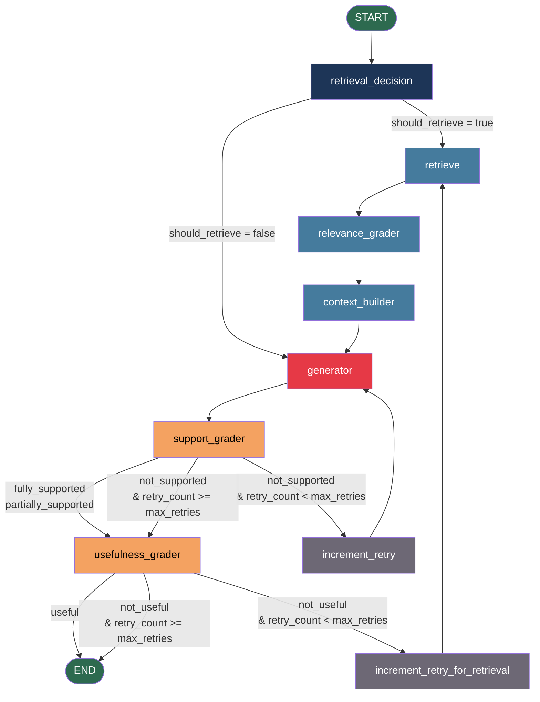

# Self-RAG Retrieval Engine

 **Self-Reflective Retrieval-Augmented Generation** system built with LangGraph, Qdrant, and exposed as an MCP (Model Context Protocol) server over SSE transport.

Unlike standard RAG pipelines that blindly retrieve and generate, Self-RAG makes the LLM an active participant in its own quality control — deciding whether to retrieve, grading what it retrieved, verifying what it generated, and retrying when the answer isn't good enough.

---

## Table of Contents

- [What is Self-RAG?](#what-is-self-rag)
- [Key Features](#key-features)
- [Architecture Overview](#architecture-overview)
- [Self-RAG Graph Flow](#self-rag-graph-flow)
  - [Node Reference](#node-reference)
  - [Routing Logic](#routing-logic)
- [Retrieval Pipeline](#retrieval-pipeline)
- [Ingestion Pipeline](#ingestion-pipeline)
- [MCP Server & Client](#mcp-server--client)
- [LLM Backends: vLLM & OpenRouter](#llm-backends-vllm--openrouter)
- [Plug-and-Play Retrieval](#plug-and-play-retrieval-no-ingestion-required)
- [Project Structure](#project-structure)
- [Setup & Installation](#setup--installation)
- [Configuration](#configuration)
- [Running the System](#running-the-system)
- [Running Tests](#running-tests)
- [Tech Stack](#tech-stack)

---

## What is Self-RAG?

Standard RAG has a fundamental problem: it always retrieves (even when unnecessary), never checks if retrieved documents are relevant, and never verifies if the generated answer is actually grounded in those documents.

**Self-RAG** (introduced in the paper [Self-RAG: Learning to Retrieve, Generate, and Critique Through Self-Reflection](https://arxiv.org/abs/2310.11511)) solves this by inserting reflection steps at every stage:

| Stage | Standard RAG | Self-RAG |
|---|---|---|
| Retrieval decision | Always retrieves | LLM decides if retrieval is needed |
| Document filtering | Uses all retrieved docs | LLM grades each doc for relevance |
| Generation | Generate once | Generate, then verify grounding |
| Answer quality | No check | LLM grades usefulness, retries if needed |

This implementation uses **LangGraph** to model the Self-RAG flow as a stateful directed graph with conditional edges, enabling dynamic routing, retry loops, and full state traceability.

---

## Key Features

### 🔌 Plug-and-Play Retrieval Engine
- **Standalone MCP server** works with ANY vector database (Qdrant, Pinecone, Weaviate, Chroma, pgvector)
- **Connect to existing indexes** — no ingestion pipeline required
- **Configuration-driven** — change database by editing `.env`
- **Retrieval latency** ~0.75s end-to-end

### 🎯 Advanced Retrieval Pipeline
- **Hybrid search** — Dense (semantic) + Sparse (BM25 keywords) fused via RRF
- **MMR reranking** — Prevents duplicate/similar results while maintaining relevance
- **Cross-encoder scoring** — FlashRank (ms-marco-MiniLM int8) for final quality ranking
- **Parent expansion** — Optional hierarchical context expansion
- **Graceful fallbacks** — Works with or without parent collections, flattens if needed

### 🧠 Self-RAG Grading
- **Retrieval decision** — LLM decides if external knowledge is needed
- **Relevance grading** — Per-document relevance filtering
- **Support grading** — Detects hallucinations (answer grounded in context?)
- **Usefulness grading** — Checks if answer resolves the user's question
- **Automatic retries** — Re-generates or re-retrieves if quality checks fail

### 🛠️ Flexible Ingestion (Optional)
- **Hierarchical chunking** — Parent-child chunk hierarchy with deduplication
- **Flat ingestion** — Index documents as-is without hierarchy
- **Idempotent** — UUID5-based deterministic IDs, safe to re-ingest
- **DB-agnostic** — Works with any vector database

---

## Architecture Overview

```
┌─────────────────────────────────────────────────────────────────┐
│                        MCP Client (SSE)                         │
│                    rich interactive terminal                     │
└──────────────────────────┬──────────────────────────────────────┘
                           │ SSE  http://127.0.0.1:8000/sse
┌──────────────────────────▼──────────────────────────────────────┐
│                      MCP Server (SSE)                           │
│              MCPServer  ·  3 tools exposed                      │
│         rag_answer  ·  retrieve  ·  server_health               │
│                                                                 │
│    🔌 Plug-and-Play: Works with ANY vector database & index    │
└──────────┬──────────────────────────────┬───────────────────────┘
           │                              │
┌──────────▼──────────┐       ┌───────────▼──────────────────────┐
│   Self-RAG Graph    │       │     Hybrid Retriever Pipeline    │
│   (Optional)        │       │   (DB-Agnostic, Standalone)      │
│                     │       │                                  │
│  retrieval_decision │       │  1. Hybrid Search (DB)           │
│  retrieve           │       │     Dense + Sparse (BM25)        │
│  relevance_grader   │       │     Fusion: RRF/Weighted         │
│  context_builder    │       │                                  │
│  generator          │       │  2. MMR Diversity Reranking      │
│  support_grader     │       │                                  │
│  usefulness_grader  │       │  3. FlashRank Cross-Encoder      │
│                     │       │     (ms-marco-MiniLM-L-12-v2)    │
└──────────┬──────────┘       │                                  │
           │                  │  4. Parent Expansion (Optional)  │
           │                  └───────────────┬──────────────────┘
           │                                  │
┌──────────▼──────────────────▼──────────────────────────────────┐
│              Vector Database (Any Provider)                     │
│                                                                 │
│  ✓ Qdrant        ✓ Pinecone    ✓ Weaviate                      │
│  ✓ Chroma        ✓ pgvector    (adapters ready)                │
│                                                                 │
│  User's Pre-Indexed Collections (No Ingestion Required!)       │
└─────────────────────────────────────────────────────────────────┘
```

**Key:** Retrieval and ingestion are **completely decoupled**. The MCP server works as a standalone retrieval engine with any pre-indexed vector database.

---

## Self-RAG Graph Flow



### Node Reference

#### `retrieval_decision`
The entry point of the graph. The LLM analyzes the user's question and decides whether external knowledge retrieval is actually needed.

- Conversational queries (`"Hello"`, `"What is 2+2"`) → skip retrieval, go directly to `generator`
- Factual / domain queries → proceed to `retrieve`

Uses structured output: `RetrievalDecision { thought: str, answer: "YES" | "NO" }`

---

#### `retrieve`
Runs the full **Hybrid Retrieval Pipeline** against Qdrant:

1. **Hybrid Search** — combines dense (OpenAI `text-embedding-3-small`) and sparse (BM25 via FastEmbed) vectors, fused server-side with Reciprocal Rank Fusion (RRF)
2. **MMR** — Maximal Marginal Relevance reranking for diversity (avoids returning near-duplicate chunks)
3. **FlashRank** — lightweight ONNX cross-encoder reranker (`ms-marco-MiniLM-L-12-v2`) for final relevance scoring
4. **Parent Expansion** — child chunks are retrieved for precision, but the full parent chunk is returned to the LLM for richer context

---

#### `relevance_grader`
Filters retrieved documents. Each document is individually graded by the LLM against the question.

- Documents graded `YES` → kept as `relevant_documents`
- Documents graded `NO` → discarded

Uses structured output: `RelevanceGrade { thought: str, answer: "YES" | "NO" }`

---

#### `context_builder`
Formats the relevant documents into a structured XML context block optimized for LLM attention:

```xml
<context>
  <document index="1">
    <metadata>Source: hr.pdf | Relevance Score: 0.9821</metadata>
    <content>
      Human Resource Management (HRM) refers to...
    </content>
  </document>
</context>
```

---

#### `generator`
The LLM generates an answer using **only** the facts in the context block. The prompt explicitly instructs the model not to use outside knowledge and to cite document indices (`[Doc 1]`).

---

#### `support_grader`
Verifies that the generated answer is grounded in the context. Performs a claim-by-claim audit.

Returns one of:
- `fully_supported` — every claim is backed by the context
- `partially_supported` — some claims are grounded, others are not
- `not_supported` — answer contains hallucinations or contradicts the context

Uses structured output: `SupportGrade { thought: str, label: "fully_supported" | "partially_supported" | "not_supported" }`

---

#### `usefulness_grader`
Evaluates whether the answer actually resolves the user's question — even if it's grounded, it might be evasive or incomplete.

Returns one of:
- `useful` — answer directly satisfies the query
- `not_useful` — answer is off-topic, incomplete, or evasive

Uses structured output: `UsefulnessGrade { thought: str, label: "useful" | "not_useful" }`

---

#### `increment_retry` / `increment_retry_for_retrieval`
Bookkeeping nodes that increment `retry_count` in the graph state before looping back to `generator` or `retrieve` respectively.

---

### Routing Logic

| Router | Condition | Next Node |
|---|---|---|
| `route_after_retrieval_decision` | `should_retrieve = True` | `retrieve` |
| | `should_retrieve = False` | `generator` |
| `route_after_support` | `fully_supported` or `partially_supported` | `usefulness_grader` |
| | `not_supported` and `retry_count < max_retries` | `increment_retry` → `generator` |
| | `not_supported` and `retry_count >= max_retries` | `usefulness_grader` |
| `route_after_usefulness` | `useful` | `END` |
| | `not_useful` and `retry_count < max_retries` | `increment_retry_for_retrieval` → `retrieve` |
| | `not_useful` and `retry_count >= max_retries` | `END` |

---

## Retrieval Pipeline

```
Query
  │
  ▼
Qdrant Hybrid Search (Dense + BM25 + RRF)   k=20 candidates
  │
  ▼
MMR Diversity Reranking                      k=15 diverse docs
  │
  ▼
FlashRank Cross-Encoder                      top_k=4 final docs
  │
  ▼
Parent Document Expansion                    fetch full parent chunks
  │
  ▼
List[Document] → relevance_grader
```

**Why this multi-stage funnel?**

- Hybrid search (dense + sparse) gives better recall than either alone — dense catches semantic matches, BM25 catches exact keyword matches
- MMR prevents the LLM from seeing 4 near-identical chunks — forces diversity
- FlashRank (ONNX int8 quantized) gives cross-encoder quality at ~0.1s vs ~19s for a full PyTorch CrossEncoder
- Parent expansion means retrieval precision comes from small child chunks, but the LLM gets the full surrounding context

---

## Ingestion Pipeline (Optional)

The ingestion pipeline is **optional** and independent of retrieval. Choose your ingestion strategy:

### Hierarchical Ingestion (Default)

Documents are split into a **parent-child chunk hierarchy**:

```
PDF Document
  │
  ├── Parent Chunk 1  (1200 chars, overlap=0)  → stored in self_rag_parents
  │     ├── Child Chunk 1a  (600 chars, overlap=150)  → stored in self_rag_documents
  │     ├── Child Chunk 1b
  │     └── Child Chunk 1c
  │
  ├── Parent Chunk 2
  │     ├── Child Chunk 2a
  │     └── Child Chunk 2b
  ...
```

- **Child chunks** are indexed with both dense + sparse vectors for hybrid search precision
- **Parent chunks** are stored with dense vectors only, used for context expansion after retrieval
- UUIDs are deterministic (UUID5) so re-ingestion is idempotent

```bash
uv run python scripts/ingest.py --reset  # Hierarchical mode (default)
```

### Flat Ingestion (No Hierarchy)

Documents indexed as-is, no parent-child relationships:

```bash
uv run python scripts/ingest.py --reset --flat
```

- Single collection
- No parent expansion overhead
- Suitable for pre-chunked data or Q&A pairs

### No Ingestion (Bring Your Own Index)

Skip ingestion entirely and connect to existing indexed data:

```env
# .env — Point to your pre-indexed collection
VECTORDB_PROVIDER=pinecone
RETRIEVAL_COLLECTION=your_index_name
```

```bash
uv run python src/self_rag/mcp/server.py  # Retrieval only
```

---

## MCP Server & Client

The system is exposed as an **MCP server** over SSE transport, making it compatible with any MCP client (Claude Desktop, custom clients, etc.).

### Tools

| Tool | Description |
|---|---|
| `rag_answer` | Runs the full Self-RAG graph — retrieval decision → retrieve → grade → generate → verify → retry |
| `retrieve` | Raw hybrid retrieval only, no generation or grading |
| `server_health` | Returns operational status of retriever and reranker components |

### Interactive Client

A rich terminal client is included with a menu-driven interface:

```
╭─────────────────────────────────╮
│ Self-RAG MCP Interactive Client │
│ Connected via SSE Transport     │
╰─────────────────────────────────╯

[1] 💬 Ask Question     (rag_answer)
[2] 🔍 Raw Search       (retrieve)
[3] 🏥 System Health    (server_health)
[4] 📋 List Tools
[0] 🚪 Exit
```

---

## Project Structure

```
self_rag_retrieval/
├── src/self_rag/
│   ├── clients/
│   │   ├── llm.py              # LiteLLM chat model + OpenAI embeddings (cached)
│   │   └── qdrant.py           # Qdrant client singleton
│   ├── core/
│   │   └── config.py           # Pydantic settings from .env
│   ├── graph/
│   │   ├── engine.py           # Compiled graph singleton (lru_cache)
│   │   ├── routes.py           # Conditional edge routing functions
│   │   └── workflow.py         # LangGraph StateGraph definition
│   ├── ingestion/
│   │   ├── chunker.py          # Parent-child chunk splitting
│   │   ├── indexer.py          # Qdrant collection management
│   │   ├── loaders.py          # PDF loader
│   │   └── pipeline.py         # Ingestion orchestration
│   ├── mcp/
│   │   ├── server.py           # MCPServer with 3 tools + startup warmup
│   │   ├── mcp_client.py       # Rich interactive terminal client
│   │   └── tools.py            # Tool implementations (answer, retrieve, health)
│   ├── models/
│   │   ├── graph_state.py      # LangGraph TypedDict state
│   │   └── schemas.py          # Pydantic structured output schemas
│   ├── nodes/
│   │   ├── context_builder.py  # XML context formatter
│   │   ├── generator.py        # LLM answer generation
│   │   ├── relevance_grader.py # Per-document relevance grading
│   │   ├── retrieval_decision.py # Retrieval necessity classifier
│   │   ├── retrieve.py         # Retrieval node
│   │   ├── support_grader.py   # Hallucination / grounding checker
│   │   └── usefulness_grader.py # Answer quality checker
│   ├── prompts/
│   │   ├── generation.py
│   │   ├── relevance.py
│   │   ├── retrieval.py
│   │   ├── support.py
│   │   └── usefulness.py
│   ├── retrieval/
│   │   ├── mmr.py              # Maximal Marginal Relevance
│   │   ├── reranker.py         # FlashRank ONNX cross-encoder
│   │   ├── retriever.py        # HybridRetriever orchestrator (cached)
│   │   └── vector_store.py     # Qdrant vector store (dense + sparse, cached)
│   └── services/
│       └── rag_service.py      # Business layer wrapping the graph
├── scripts/
│   └── ingest.py               # CLI ingestion script
├── tests/
│   ├── test_mcp_server.py
│   ├── test_mcp_tools.py
│   └── test_routes.py
├── docker-compose.yaml
├── pyproject.toml
└── .env
```

---

## Setup & Installation

### Prerequisites

- Python 3.12+
- [uv](https://docs.astral.sh/uv/) package manager
- **Optional:** Docker (for Qdrant) or external vector database connection details
- **Optional:** OpenRouter API key (if using cloud LLM)

### 1. Clone and install dependencies

```bash
git clone <repo-url>
cd self_rag_retrieval
uv sync
```

### 2. Configure environment

```bash
cp .env.example .env
```

Edit `.env` based on your use case:

#### Option A: Full Self-RAG (Ingestion + Retrieval with Qdrant)

```env
OPENROUTER_API_KEY=sk-or-v1-...
CHAT_MODEL=openrouter/openai/gpt-4.1-mini
EMBEDDING_MODEL=openai/text-embedding-3-small

VECTORDB_PROVIDER=qdrant
QDRANT_URL=http://localhost:6333
RETRIEVAL_COLLECTION=self_rag_documents
PARENT_EXPANSION_COLLECTION=self_rag_parents

DATA_DIR=src/self_rag/data
```

#### Option B: Pure Retrieval (External Index, No Ingestion)

```env
OPENROUTER_API_KEY=sk-or-v1-...

VECTORDB_PROVIDER=pinecone  # or qdrant, weaviate, chroma
PINECONE_API_KEY=pk-xxx
RETRIEVAL_COLLECTION=your_existing_index
PARENT_EXPANSION_COLLECTION=null
```

### 3. (Optional) Start Qdrant

Only needed if using Qdrant and self-ingestion:

```bash
docker compose up -d
```

### 4. (Optional) Add documents and ingest

Only needed for self-RAG ingestion:

```bash
# Add PDFs to src/self_rag/data/

# Ingest hierarchically (default)
uv run python scripts/ingest.py --reset

# Or ingest flat (no parent-child hierarchy)
uv run python scripts/ingest.py --reset --flat
```

### 5. Start the MCP server

```bash
uv run python src/self_rag/mcp/server.py
```

The server works whether you ingested data or are connecting to an external index.

---

## Configuration

All settings are in `.env` and validated by Pydantic.

### Database & Collection Settings

| Variable | Default | Description |
|---|---|---|
| `VECTORDB_PROVIDER` | `qdrant` | Vector DB provider: `qdrant`, `pinecone`, `weaviate`, `chroma` |
| `VECTORDB_HYBRID_STRATEGY` | `rrf` | Hybrid search strategy: `rrf`, `weighted`, `semantic`, `two_pass` |
| `RETRIEVAL_COLLECTION` | `self_rag_documents` | Collection name for retrieval (configurable for any index) |
| `PARENT_EXPANSION_COLLECTION` | `self_rag_parents` | Collection for parent expansion (set to `null` to disable) |

### Database-Specific Settings

```env
# Qdrant (recommended)
QDRANT_URL=http://localhost:6333
QDRANT_API_KEY=

# Pinecone
PINECONE_API_KEY=pk-xxx
PINECONE_INDEX_NAME=my-index

# Weaviate
WEAVIATE_URL=http://localhost:8080

# Chroma
CHROMA_PERSIST_DIR=./chroma_data
```

### Retrieval Tuning

| Variable | Default | Description |
|---|---|---|
| `RETRIEVAL_K_INITIAL` | `20` | Hybrid search candidate pool |
| `RETRIEVAL_K_MMR` | `15` | Docs after MMR diversity filter |
| `RETRIEVAL_K_RERANK` | `4` | Final docs after FlashRank |
| `RETRIEVAL_LAMBDA` | `0.5` | MMR relevance-vs-diversity balance (0-1) |

### Ingestion Settings (Optional)

| Variable | Default | Description |
|---|---|---|
| `CHUNK_SIZE` | `600` | Child chunk size (chars) |
| `CHUNK_OVERLAP` | `150` | Child chunk overlap |
| `PARENT_CHUNK_SIZE` | `1200` | Parent chunk size (chars) |

### LLM & Model Settings

| Variable | Default | Description |
|---|---|---|
| `USE_VLLM` | `true` | `true` → local vLLM backend, `false` → OpenRouter |
| `VLLM_BASE_URL` | `http://localhost:8000/v1` | vLLM OpenAI-compatible endpoint |
| `VLLM_MODEL` | `qwen2.5-7b-instruct-awq` | Model served by vLLM |
| `OPENROUTER_API_KEY` | — | Required when `USE_VLLM=false` (also used for embeddings, always) |
| `OPENROUTER_MODEL` | `openai/gpt-4.1-mini` | Chat model when routed through OpenRouter |
| `EMBEDDING_MODEL` | `openai/text-embedding-3-small` | Dense embedding model (1536-dim) — always via OpenRouter |
| `LLM_TEMPERATURE` | `0.0` | LLM temperature (0 = deterministic) |
| `MAX_RETRIES` | `3` | Max Self-RAG retry loops |

See [LLM Backends: vLLM & OpenRouter](#llm-backends-vllm--openrouter) for how backend switching and prefix caching work.

---

## LLM Backends: vLLM & OpenRouter

Every LLM call in the graph (retrieval decision, relevance grading, generation, support grading, usefulness grading) goes through a single `ChatLiteLLM` singleton (`src/self_rag/clients/llm.py`), so the backend is swapped with **one config flag** — no code changes.

### Switching backends

`Settings.resolve_llm_provider` (`src/self_rag/core/config.py`) picks the endpoint at startup based on `USE_VLLM`:

```env
# Local GPU inference via vLLM (default)
USE_VLLM=true
VLLM_BASE_URL=http://localhost:8000/v1
VLLM_MODEL=qwen2.5-7b-instruct-awq
VLLM_API_KEY=                       # not required for local vLLM

# Cloud fallback via OpenRouter
USE_VLLM=false
OPENROUTER_API_KEY=sk-or-v1-...
OPENROUTER_MODEL=openai/gpt-4.1-mini
```

Embeddings always go through OpenAI (via OpenRouter), independent of `USE_VLLM` — only the chat/grading model moves between backends.

### Running vLLM locally

`vllm/` ships an OpenAI-compatible vLLM V1 server as its own Docker image, wired up in `docker-compose.yaml`:

```bash
docker compose up -d vllm      # serves Qwen2.5-7B-Instruct-AWQ on :8001
```

Key serving flags (`vllm/entrypoint.sh`, configurable via env vars):

| Variable | Default | Purpose |
|---|---|---|
| `MODEL_NAME` | `Qwen/Qwen2.5-7B-Instruct-AWQ` | Model to serve (AWQ-quantized for lower VRAM) |
| `GPU_MEMORY_UTILIZATION` | `0.80` | Fraction of GPU memory vLLM is allowed to claim |
| `MAX_MODEL_LEN` | `8192` | Context window |
| `MAX_NUM_SEQS` | `32` | Max concurrent sequences (batch size) |
| `KV_CACHE_DTYPE` | `fp8` | Compressed KV cache storage → more cache capacity per GB of VRAM |

### Prefix caching (implemented)

The Self-RAG graph is a heavy repeat-prefix workload: every retrieval-decision, relevance-grading (once **per retrieved document**), support-grading, and usefulness-grading call re-sends the same system prompt, and `relevance_grader` alone can fire the grading system prompt up to `RETRIEVAL_K_MMR` times in a single query. Without prefix reuse, the model would re-run the full prefill pass over that identical system prompt on every one of those calls.

vLLM is started with **`--enable-prefix-caching`** (`vllm/entrypoint.sh`), vLLM V1's automatic prefix caching (APC). It hashes and caches KV blocks for prompt prefixes shared across requests, so once the shared grading/system prompt has been prefilled once, subsequent calls in the same query (and across queries, while the block stays resident) skip straight to the new suffix instead of recomputing the whole prefix. Combined with `fp8` KV-cache storage (more cached blocks fit in the same VRAM) and AWQ weight quantization (frees VRAM for cache/batch headroom), this is what keeps the sequential per-document grading loop affordable on a single GPU.

> **Design note:** `vllm.txt` also documents a planned disaggregated **prefill/decode (P/D)** deployment — separate prefill and decode vLLM workers connected via NIXL for KV-cache transfer, an optional LMCache tier for offloading KV blocks to CPU/storage, and an `llm-d` router doing KV-aware request routing. This is architecture notes for scaling beyond a single GPU, not yet wired into `docker-compose.yaml` — the current compose setup runs vLLM `standalone` (`VLLM_KV_ROLE` unset), with `vllm/entrypoint.sh` already supporting `kv_producer` / `kv_consumer` roles for when that split is turned on.

---

## Plug-and-Play Retrieval (No Ingestion Required)

The MCP server is a **standalone retrieval engine** that works with ANY pre-indexed vector database. No ingestion pipeline needed.

### Quick Start with External Index

```env
# .env — Point to your existing index
VECTORDB_PROVIDER=pinecone
PINECONE_API_KEY=pk-xxx
RETRIEVAL_COLLECTION=your_existing_index
PARENT_EXPANSION_COLLECTION=null
```

```bash
# Start server (connects to your index, no ingestion)
uv run python src/self_rag/mcp/server.py

# Use it
retrieve_documents(query="...", top_k=5, expand_parents=false)
```

### Supported Databases

| Database | Status | Notes |
|----------|--------|-------|
| **Qdrant** | ✅ Full Support | Native hybrid search, parent expansion |
| **Pinecone** | ✅ Full Support | Dense-only, serverless |
| **Weaviate** | ✅ Full Support | Open-source, hybrid-capable |
| **Chroma** | ✅ Full Support | Lightweight, embedded |
| **pgvector** | ✅ Adapter Ready | PostgreSQL extension |

Just configure `.env` and connect to your database. No code changes needed.

---

## Running the System

### Option 1: Self-RAG Ingestion + Retrieval (Full Pipeline)

**Terminal 1 — Ingest documents**

```bash
# First time (creates hierarchical chunks)
uv run python scripts/ingest.py

# Or use flat ingestion (no hierarchy)
uv run python scripts/ingest.py --flat

# Full rebuild (wipes collections)
uv run python scripts/ingest.py --reset
```

**Terminal 2 — Start the MCP server**

```bash
uv run python src/self_rag/mcp/server.py
```

The server warms up all models before accepting connections:

```
INFO  Warming up retriever...
INFO  Warming up reranker...
INFO  Warming up graph...
INFO  Warmup complete — server ready.
INFO  Uvicorn running on http://127.0.0.1:8000
```

**Terminal 3 — Start the interactive client**

```bash
uv run python src/self_rag/mcp/mcp_client.py
```

### Option 2: Pure Retrieval (No Ingestion, External Index)

Just configure your vector database and collection name in `.env`, then:

```bash
uv run python src/self_rag/mcp/server.py
```

The server connects to your pre-indexed database and serves as a retrieval engine. No ingestion needed.

### Retrieval Modes

The `retrieve_documents` MCP tool supports flexible retrieval:

```python
# Mode 1: With parent expansion (hierarchical data)
retrieve_documents(
    query="What is our policy?",
    top_k=4,
    expand_parents=True  # Fetches full parent chunks
)
→ Returns: Parent documents (full context)

# Mode 2: Without expansion (flat data or external index)
retrieve_documents(
    query="What is our policy?",
    top_k=5,
    expand_parents=False  # Returns ranked docs as-is
)
→ Returns: Ranked documents

# Mode 3: Auto-fallback (graceful)
retrieve_documents(query="...")
# If parent collection missing/disabled → returns ranked docs automatically
```

### Sample questions (HR domain)

```
What is Human Resource Management and what are its main objectives?
What are the nine broad areas of HRM activities identified by ASTD?
What is the difference between training and organizational development?
How does compensation and benefits management work in HRM?
What is the role of HRM in the new millennium?
What is the significance of HR planning in an organization?
Explain the scope of HRM and what it covers in an employee's working life.
```

---

## Running Tests

```bash
uv run pytest tests/ -v
```

```
tests/test_routes.py::test_retrieval_decision_retrieve          PASSED
tests/test_routes.py::test_retrieval_decision_skip              PASSED
tests/test_routes.py::test_support_fully_supported_...          PASSED
tests/test_routes.py::test_support_not_supported_retries...     PASSED
tests/test_routes.py::test_usefulness_useful_ends               PASSED
...
24 passed
```

Test coverage:
- **`test_routes.py`** — all routing branches (retrieval decision, support grading, usefulness grading)
- **`test_mcp_tools.py`** — tool functions with mocked Qdrant/LLM (empty input, clamping, exceptions, health)
- **`test_mcp_server.py`** — server type, tool registration, tool descriptions

---

## Tech Stack

### Retrieval & Search
| Component | Technology |
|---|---|
| Graph orchestration | [LangGraph](https://github.com/langchain-ai/langgraph) |
| Dense embeddings | OpenAI `text-embedding-3-small` (1536-dim) |
| Sparse embeddings | [FastEmbed](https://github.com/qdrant/fastembed) BM25 |
| Hybrid fusion | RRF (Reciprocal Rank Fusion), Weighted, Semantic |
| MMR reranking | Maximal Marginal Relevance (custom implementation) |
| Cross-encoder | [FlashRank](https://github.com/PrithivirajDamodaran/FlashRank) `ms-marco-MiniLM-L-12-v2` (ONNX int8) |

### Vector Databases (DB-Agnostic)
| Database | Status | Support |
|----------|--------|---------|
| [Qdrant](https://qdrant.tech/) | ✅ Full | Native hybrid, parent expansion |
| [Pinecone](https://www.pinecone.io/) | ✅ Full | Dense-only, serverless |
| [Weaviate](https://weaviate.io/) | ✅ Full | Open-source, hybrid-capable |
| [Chroma](https://www.trychroma.com/) | ✅ Full | Lightweight, embedded |
| pgvector | ✅ Ready | PostgreSQL extension |

### AI & LLM
| Component | Technology |
|---|---|
| LLM routing | [LiteLLM](https://github.com/BerriAI/litellm) (100+ providers) |
| LLM (default) | [vLLM](https://github.com/vllm-project/vllm) V1, local GPU, `Qwen2.5-7B-Instruct-AWQ` |
| LLM (fallback) | [OpenRouter](https://openrouter.ai/) (`gpt-4.1-mini` by default) |
| Quantization | AWQ (weights) + fp8 (KV cache) |
| Inference optimization | vLLM automatic prefix caching (`--enable-prefix-caching`) |
| Structured output | Pydantic schemas + LLM structured output |

### Framework & Infrastructure
| Component | Technology |
|---|---|
| MCP framework | [MCP Python SDK](https://github.com/modelcontextprotocol/python-sdk) v2 |
| Transport | SSE (Server-Sent Events) over HTTP |
| Settings | [Pydantic Settings](https://docs.pydantic.dev/latest/concepts/pydantic_settings/) |
| Terminal UI | [Rich](https://github.com/Textualize/rich) |
| Package manager | [uv](https://docs.astral.sh/uv/) |
| Container runtime | Docker (for Qdrant, optional) |
| Python runtime | 3.12+ |
